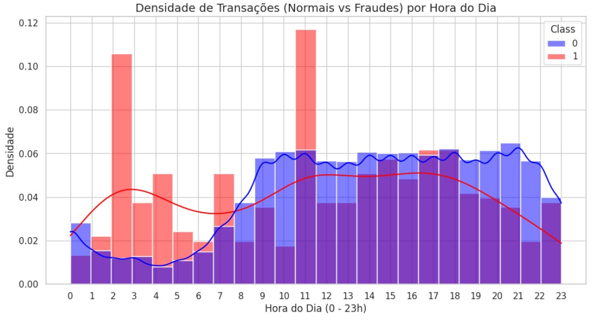

# Deteção de Transações Fraudulentas 

## Identificação da Equipa
* **Grupo nº: 8**
* **Membros:**
 * **João Freire - (a2023128832)**
 * **Rodrigo Ferrão - (a2022138105)** 
 * **Tomás Moreira - (a2023143375)** 

## Organização do Repositório
A estrutura deste projeto segue as boas práticas de Ciência de Dados e Engenharia de Software:
* *data/*: Armazenamento de dados (dados brutos em raw/ e processados em processed/).
* *docs/*: Documentação técnica detalhada dividida por Milestones (M1, M2 e M3).
* *notebooks/*: Jupyter Notebooks para experimentação, limpeza e modelação.
* *src/*: Código-fonte modular (scripts .py) para funções reutilizáveis.
* *reports/*: Relatórios finais, apresentações e exportação de figuras (figures/).
* *requirements.txt*: Ficheiro de configuração com as bibliotecas necessárias.

## 1. Iniciação (Milestone 1)
### Contexto e Problema de Negócio
A fraude com cartões de crédito gera prejuízos financeiros massivos para bancos e consumidores. O desafio central é identificar transações fraudulentas em tempo real. No entanto, este é um problema de "procurar uma agulha no palheiro": a grande maioria das transações é legítima, tornando a deteção difícil sem gerar muitos alarmes falsos.

**O Desafio Técnico:** O dataset apresenta um desequilíbrio extremo (apenas 0.172% são fraudes), o que invalida métricas tradicionais como a "Acurácia".

### Objetivos do Projeto
* **Objetivo 1:** Desenvolver um modelo de classificação para identificar transações fraudulentas em cartões de crédito com uma métrica AUPRC mínima de 0.80, utilizando o dataset disponibilizado no Kaggle, para ser validado e apresentado no Milestone 3.
* **Objetivo 2:** Aplicar a técnica SMOTE (oversampling) para corrigir o desequilíbrio extremo dos dados, treinando um algoritmo que atinja uma Sensibilidade (Recall) superior a 85%, garantindo a minimização de perdas financeiras (falsos negativos), até à entrega final do projeto.

### Fonte de Dados
* **Dataset:** [Credit Card Fraud Detection (Kaggle)](https://www.kaggle.com/datasets/mlg-ulb/creditcardfraud)
* **Dimensão:** 284.807 transações, 31 colunas.

## 2. Exploração (Milestone 2)
### Limpeza e Preparação
* **Valores Nulos:** Confirmou-se a integridade total do dataset (zero valores nulos em todas as colunas).
* **Registos Duplicados:** Foram identificadas e removidas 1.081 transações duplicadas, resultando num conjunto final de 283.726 registos. Este passo de limpeza é fundamental para evitar o enviesamento (overfitting) dos modelos de Machine Learning.
* **Tratamento de Outliers:** Optou-se estrategicamente por manter os valores extremos (especialmente na variável `Amount`). Como o objetivo é detetar fraudes (que são anomalias estatísticas), a remoção cega de outliers poderia eliminar as próprias transações que pretendemos prever. A amplitude destes valores será tratada com `RobustScaler` na próxima fase.
### Principais Conclusões (EDA)

* **Ponto-chave: Entre as 2h e as 3h e ás 11h são as horas onde ocorrem o maior número de fraudes**
do método ganho de informação]
## 3. Modelação (Milestone 3)
### Abordagem Técnica
* **Modelos:** [Ex: Random Forest e XGBoost]
* **Métrica Principal:** [Ex: F1-Score ou RMSE]
## 4. Finalização (Milestone 4)
### Resposta ao Problema
[Resumo da solução e como ela gera valor para o negócio.]
### Recomendações de Inovação
1. [Sugestão prática baseada nos resultados]
## Como Reproduzir este Projeto
1. Clone o repositório: `git clone [url-do-repo]`
2. Instale as dependências: `pip install -r requirements.txt`
3. Execute os notebooks na pasta `notebooks/` seguindo a ordem numérica.
**Instituição:** Coimbra Business School | ISCAC
**Curso:** Licenciatura em Ciência de Dados para a Gestão
**Unidade Curricular:** Projeto em Ciência de Dados
**Professor Responsável:** Dora Melo (dmelo@iscac.pt)

