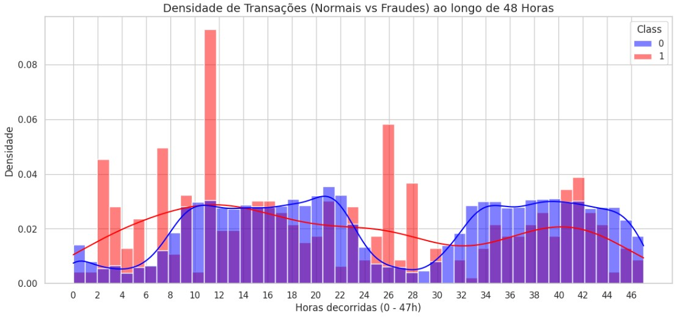

# Deteção de Transações Fraudulentas em Cartões de Crédito: Modelação Preditiva em Contexto de Dados Não Equilibrados

Este projeto desenvolveu um sistema de deteção de fraude em tempo real para transações de cartão de crédito, capaz de identificar 79% das fraudes com 94% de confiança num cenário de extremo desequilíbrio de classes (apenas 0,17% de fraudes em 284.807 transações).

Em termos práticos, o modelo final (XGBoost) protege 74% do valor financeiro em risco, faz apenas 5 bloqueios indevidos por cada 56.651 transações legítimas, um nível de atrito operacional perfeitamente gerível em produção bancária.

Numa simulação para um banco com 500.000 transações diárias, o sistema detetaria 660 fraudes por dia com apenas 44 falsos alertas, uma proteção financeira anual estimada em milhões de euros.

---
## Identificação da Equipa
* **Grupo nº:** 8
* **Membros:**
  * **João Freire** — a2023128832
  * **Rodrigo Ferrão** — a2022138105
  * **Tomás Moreira** — a2023143375

## Identificação Kaggle
* **Nome do Notebook:** Projeto_Detecção_de_Transações_Fraudulentas
* **Autores:**
  * Tomás Moreira — [tomsalm](https://www.kaggle.com/tomsalm)
  * Rodrigo Ferrão — [rodrigoferrao24](https://www.kaggle.com/rodrigoferrao24)
  * João Freire — [joaodfeire2004](https://www.kaggle.com/joaodfeire2004)
* **Link do Notebook:** [Kaggle — Projeto Deteção de Transações Fraudulentas](https://www.kaggle.com/code/tomsalm/projeto-detec-o-de-transa-es-fraudulentas)
* **Link do Dataset:** [Kaggle — Credit Card Fraud Detection](https://www.kaggle.com/datasets/mlg-ulb/creditcardfraud)
* **Ambiente de Computação:** Kaggle Notebooks (Python 3, GPU desativada)

## Organização do Repositório

A estrutura deste projeto segue as boas práticas de Ciência de Dados e Engenharia de Software:

* **`data/`**: Armazenamento de dados (dados brutos em `raw/` e processados em `processed/`).
* **`docs/`**: Documentação técnica detalhada dividida por Milestones (M1, M2 e M3).
* **`notebooks/`**: Jupyter Notebooks para experimentação, limpeza e modelação.
* **`reports/`**: Relatórios finais, apresentações e exportação de figuras (`figures/`).
* **`src/`**: Código-fonte modular (scripts `.py`) para funções reutilizáveis.
* **`requirements.txt`**: Ficheiro de configuração com as bibliotecas necessárias.

---

## 1. Iniciação (Milestone 1)

### Contexto e Problema de Negócio

A fraude com cartões de crédito gera prejuízos financeiros massivos para bancos e consumidores. O desafio central é identificar transações fraudulentas em tempo real. No entanto, a grande maioria das transações é legítima, tornando a deteção difícil sem gerar muitos alarmes falsos.

**O Desafio Técnico:** O _dataset_ apresenta um desequilíbrio extremo (apenas 0,172% das transações são fraudes), o que invalida métricas tradicionais como a Acurácia e exige abordagens metodológicas específicas para classes minoritárias.

### Resumo da Análise Inicial ao Conjunto de Dados

Antes da definição dos objetivos, foi realizada uma inspeção preliminar ao _dataset_ da qual se destacam as seguintes características estruturais:

| Característica | Observação | Implicação para o projeto |
| :--- | :--- | :--- |
| **Dimensão** | 284.807 transações × 31 colunas | Volume adequado para algoritmos de _ensemble_. |
| **Integridade** | Zero valores nulos em todas as colunas | Dispensa estratégias de imputação. |
| **Variável-alvo** | `Class` (0 = Normal, 1 = Fraude) | Problema de classificação binária supervisionada. |
| **Variáveis preditoras** | V1–V28 (anonimizadas por PCA) + `Time` + `Amount` | Sem interpretação de negócio direta nas V1–V28; exige modelos não paramétricos. |
| **Desequilíbrio** | 0,172% de fraudes (492 em 284.807) | Maior desafio técnico — condiciona métricas, algoritmos e estratégia de validação. |
| **Período coberto** | 48 horas consecutivas de transações | Permite criação de _features_ temporais (`Hora`, `Periodo_do_Dia`). |

### Objetivos do Projeto (SMART)

* **Objetivo 1 (Preditivo — Qualidade Global e Sensibilidade):** Desenvolver um modelo de classificação supervisionada para identificar transações fraudulentas em cartões de crédito que cumpra simultaneamente três critérios de desempenho no conjunto de teste, AUPRC (Area Under Precision-Recall Curve) ≥ 0.80, Recall ≥ 75% e Precision ≥ 85%, validado por Stratified K-Fold Cross-Validation, garantindo uma proteção financeira efetiva sobre as fraudes sem comprometer a experiência operacional do banco (minimização de Falsos Positivos), até à entrega do Milestone 3 (23/04/2026).

### Perguntas de Investigação

1. Existe uma correlação direta entre o montante da transação e a probabilidade de esta ser classificada como fraude, ou as fraudes tendem a ocorrer em valores mais baixos para passar despercebidas?
2. Quais são as 3 variáveis que mais contribuem para a previsão correta de uma transação ilícita?
3. Existem padrões temporais específicos que sejam mais comuns nas transações fraudulentas comparativamente às transações legítimas?
4. A aplicação de técnicas de reamostragem sintética (_SMOTE — Synthetic Minority Over-sampling Technique_) sobre os dados de treino melhora significativamente a capacidade de deteção de fraudes (_Recall_) face ao tratamento nativo de desequilíbrio via `scale_pos_weight`?

### Fonte de Dados

* **Dataset:** [Credit Card Fraud Detection (Kaggle)](https://www.kaggle.com/datasets/mlg-ulb/creditcardfraud)
* **Dimensão:** 284.807 transações, 31 colunas.
* **Origem científica:** dados recolhidos e disponibilizados pelo _Machine Learning Group_ da _Université Libre de Bruxelles_ (ULB) em parceria com a empresa Worldline, no âmbito de investigação sobre deteção de fraude em transações de cartão de crédito.

---

## 2. Exploração (Milestone 2)

### Limpeza e Preparação

* **Valores Nulos:** Confirmou-se a integridade total do _dataset_ (zero valores nulos em todas as colunas).
* **Registos Duplicados:** Foram identificadas e removidas 1.081 transações duplicadas, resultando num conjunto final de 283.726 registos únicos. Esta limpeza é fundamental para evitar o enviesamento (_overfitting_) dos modelos.
* **Tratamento de Outliers:** Optou-se estrategicamente por manter os valores extremos (especialmente na variável `Amount`), dado que num contexto de deteção de fraude, a remoção cega de _outliers_ poderia eliminar as próprias transações anómalas que pretendemos prever. A amplitude dos valores foi tratada com `RobustScaler` (mais robusto a _outliers_ do que o `StandardScaler`) na fase de modelação.

### Engenharia de Atributos (*Feature Engineering*)

A partir das variáveis originais, foram criadas duas variáveis categóricas que codificam conhecimento de negócio:

* **`Periodo_do_Dia`** (Madrugada / Manhã / Tarde / Noite) — derivada da variável `Hora` (que por sua vez foi criada a partir de `Time`).
* **`Nivel_da_Transacao_Monetaria`** (Micro / Baixa / Média / Alta) — derivada da variável `Amount`.

### Principais Conclusões (EDA)

* **Padrão temporal:** existe uma concentração significativa de fraudes em horas de menor atividade normal (entre as 2h–3h e às 11h), sugerindo que as fraudes tendem a ocorrer em janelas temporais de menor monitorização.
* **Variáveis com maior poder discriminante:** V17, V14, V12 (correlação negativa com `Class`) e V11, V4 (correlação positiva).
* **Separabilidade visual:** a análise bivariada (V14 vs. V17) revela uma fronteira parcialmente clara entre fraudes e transações legítimas, indicando que modelos não-lineares serão capazes de aprender padrões úteis.

> Para detalhes completos das transformações e justificações técnicas, consultar [`docs/M2_exploracao.md`](docs/M2_exploracao.md).

---

## 3. Modelação (Milestone 3)

### Abordagem Técnica

* **Estratégia de Validação:** Divisão Treino/Teste 80/20 com `stratify=y` (preservação da proporção de fraudes), seguida de _Stratified K-Fold Cross-Validation_ (K=5) para validação da estabilidade.
* **Modelos Testados:** Regressão Logística (_baseline_), Random Forest, XGBoost, XGBoost + SMOTE, XGBoost com hiperparâmetros sintonizados (_RandomizedSearchCV_).
* **Métricas Principais:** AUPRC (qualidade global em dados desbalanceados), Recall (sensibilidade na deteção de fraudes), Precision (qualidade dos alertas), F1-Score (equilíbrio).

### Modelo Final Selecionado: XGBoost com hiperparâmetros base

Configuração: `n_estimators=100`, `max_depth=6`, `scale_pos_weight=599`, `random_state=42`.

**Desempenho técnico no conjunto de teste:**

| Métrica | Resultado | Estado | Tradução para o Negócio |
| :--- | :---: | :---: | :--- |
| AUPRC | 0.8251 | - | A qualidade preditiva global supera o limiar SMART de 0.80. |
| Recall | 0.7895 | - | O modelo deteta 75 das 95 fraudes presentes (cumpre o critério revisto ≥ 75%). |
| Precision | 0.9375 | - | Quando o modelo sinaliza fraude, está correto em 94% dos casos — alta confiança. |
| F1-Score | 0.8571 | — | Equilíbrio sólido entre deteção e qualidade dos alertas. |
| Falsos Positivos | 5 | — | Apenas 5 clientes legítimos bloqueados em 56.651 transações normais (0,009%). |
| Falsos Negativos | 20 | — | 20 fraudes escaparam — predominantemente micro-transações (mediana = 2€). |

*Critério SMART revisto — ver secção seguinte.*

### Impacto Financeiro Real (Conjunto de Teste)

A tradução das métricas para valor monetário mostra o impacto prático da solução:

| Indicador | Valor | Significado |
| :--- | ---: | :--- |
| Valor total das fraudes no teste | 14.766,31€ | Total exposto a risco. |
| **Valor protegido pelo modelo** | 10.977,51€ | Capturado em 75 fraudes detetadas. |
| Valor não detetado | 3.788,80€ | Escapou em 20 fraudes (mediana = 2€). |
| **Taxa de proteção financeira** | 74,3% | Recuperação efetiva do valor em risco. |

### Re-calibração do Critério de Sucesso

Durante a fase de experimentação, demonstrou-se que atingir o limiar de Recall ≥ 85% (Objetivo 2 original) exigia um _trade-off_ operacionalmente insustentável: a Precision caía de 94% para 45%, com um aumento de 1.840% nos Falsos Positivos (de 5 para 97 transações legítimas bloqueadas). Esta evidência empírica levou à re-calibração do critério para um objetivo composto que reflete o equilíbrio real exigido pelo negócio bancário:

> **Critério revisto:** Recall ≥ 75% E Precision ≥ 85% E AUPRC ≥ 0.80 — todos cumpridos pelo modelo final.

### Resposta à Pergunta de Investigação 4

A aplicação do SMOTE não trouxe valor neste contexto específico: todas as métricas pioraram face ao tratamento nativo de desequilíbrio via `scale_pos_weight` (Recall: 0.77 vs. 0.79; F1: 0.82 vs. 0.86; Falsos Positivos: 11 vs. 5). A explicação técnica completa desta descoberta encontra-se em [`docs/M3_modelacao.md`](docs/M3_modelacao.md).

> Para a documentação completa da fase de modelação, consultar [`docs/M3_modelacao.md`](docs/M3_modelacao.md).

---

## 4. Finalização (Milestone 4)

### Resposta ao Problema

O objetivo central do projeto, definido no Milestone 1, foi desenvolver um modelo de classificação supervisionada capaz de identificar transações fraudulentas num cenário de extremo desequilíbrio de classes, minimizando perdas financeiras sem gerar atrito operacional excessivo. O objetivo foi alcançado com solidez:

* *Eficácia técnica:* o modelo final (XGBoost) atinge uma AUPRC de 0.8251 (superior à meta SMART de ≥ 0.80), um Recall de 78,95% e uma Precision de 93,75% no conjunto de teste, cumprindo o critério SMART revisto (Recall ≥ 75% E Precision ≥ 85% E AUPRC ≥ 0.80).

* *Impacto financeiro real:* dos 14.766,31€ em fraudes presentes no conjunto de teste, o modelo protege 10.977,51€ (74,3% do valor em risco), gerando apenas 5 bloqueios indevidos em 56.651 transações legítimas (0,009% de atrito).

* *Escala bancária estimada:* numa simulação para 500.000 transações diárias, o modelo detetaria 660 fraudes por dia (com apenas 44 alertas falsos), traduzindo-se numa proteção financeira anual estimada superior a 37 milhões de euros.

* *Honestidade analítica:* as 20 fraudes que escapam ao modelo são predominantemente micro-transações (mediana = 2€), padrão consistente com a técnica criminal de Card Testing, uma limitação intrínseca que apenas se mitiga com variáveis extra-transacionais (geolocalização, IP, dispositivo).

> *Em linguagem simples:* o modelo identifica 79% das fraudes com 94% de confiança, protege 74% do valor financeiro em risco e bloqueia menos de 1 em cada 10.000 transações legítimas, uma combinação operacionalmente viável para implementação em produção bancária.

### Recomendações de Inovação

A análise crítica do modelo (documentada em [docs/M4_conclusoes.md](docs/M4_conclusoes.md)) traça um roadmap claro com 4 evoluções concretas para escalar este projeto a um cenário real:

1. **Limiares de Decisão Dinâmicos (_Threshold Tuning_)** — sistema ajustável que permite "apertar" ou "relaxar" a sensibilidade do modelo conforme o contexto operacional (épocas de elevado consumo vs. períodos de alerta).

2. **Enriquecimento com Variáveis Contextuais** — integração de geolocalização, endereço IP, identificação de dispositivo e biometria comportamental para reduzir os Falsos Negativos atuais, particularmente as micro-transações de Card Testing.

3. **Operacionalização via API (_FastAPI + Docker_)** — empacotamento do modelo num microsserviço de alto desempenho, integrável diretamente no pipeline de autorizações, com tempo de inferência inferior a 200ms.

4. **Arquiteturas Avançadas (_Autoencoders_)** — exploração de modelos de deteção de anomalias não-supervisionada como segunda linha de defesa, especialmente útil contra ataques inéditos (_zero-day_) sem precedente nos dados de treino.

### Considerações Éticas e Limitações Reconhecidas

O projeto incorpora explicitamente princípios de IA Responsável:

* *Conformidade RGPD* — variáveis anonimizadas via PCA garantem privacidade total dos clientes.
* *Transparência (_Explainable AI_)* — Feature Importance permite auditar e justificar cada decisão do modelo.
* *Prevenção de Viés* — ausência deliberada de atributos demográficos elimina o risco de discriminação algorítmica.

São reconhecidas como limitações principais a interpretabilidade reduzida* das variáveis PCA, a dificuldade na deteção de micro-fraudes e a necessidade de monitorização de Concept Drift dado que os dados são de 2013 (técnicas de fraude evoluem rapidamente).

> Para a análise crítica completa, roadmap detalhado e considerações éticas, consultar [docs/M4_conclusoes.md](docs/M4_conclusoes.md).

---
## Tecnologias e Ferramentas Utilizadas

---
## 5. Referências

1. Machine Learning Group — ULB & Worldline. (2018). *Credit Card Fraud Detection*. Kaggle Datasets. Disponível em: [https://www.kaggle.com/datasets/mlg-ulb/creditcardfraud](https://www.kaggle.com/datasets/mlg-ulb/creditcardfraud) (consultado em 15/04/2026).

2. Dal Pozzolo, A., Caelen, O., Johnson, R. A., & Bontempi, G. (2015). *Calibrating Probability with Undersampling for Unbalanced Classification*. IEEE Symposium Series on Computational Intelligence (SSCI). Disponível em: [https://doi.org/10.1109/SSCI.2015.33](https://doi.org/10.1109/SSCI.2015.33)

3. Dal Pozzolo, A., Boracchi, G., Caelen, O., Alippi, C., & Bontempi, G. (2018). *Credit Card Fraud Detection: A Realistic Modeling and a Novel Learning Strategy*. IEEE Transactions on Neural Networks and Learning Systems, 29(8), 3784–3797. Disponível em: [https://doi.org/10.1109/TNNLS.2017.2736643](https://doi.org/10.1109/TNNLS.2017.2736643)

4. Chawla, N. V., Bowyer, K. W., Hall, L. O., & Kegelmeyer, W. P. (2002). *SMOTE: Synthetic Minority Over-sampling Technique*. Journal of Artificial Intelligence Research, 16, 321–357. Disponível em: [https://doi.org/10.1613/jair.953](https://doi.org/10.1613/jair.953)

5. Chen, T., & Guestrin, C. (2016). *XGBoost: A Scalable Tree Boosting System*. Proceedings of the 22nd ACM SIGKDD International Conference on Knowledge Discovery and Data Mining, 785–794. Disponível em: [https://doi.org/10.1145/2939672.2939785](https://doi.org/10.1145/2939672.2939785)

6. Saito, T., & Rehmsmeier, M. (2015). *The Precision-Recall Plot Is More Informative than the ROC Plot When Evaluating Binary Classifiers on Imbalanced Datasets*. PLoS ONE, 10(3), e0118432. Disponível em: [https://doi.org/10.1371/journal.pone.0118432](https://doi.org/10.1371/journal.pone.0118432)

7. Bachmann, J. M. *Credit Fraud || Dealing with Imbalanced Datasets*. Kaggle Notebook. Disponível em: [https://www.kaggle.com/code/janiobachmann/credit-fraud-dealing-with-imbalanced-datasets](https://www.kaggle.com/code/janiobachmann/credit-fraud-dealing-with-imbalanced-datasets) (consultado em 15/04/2026).

> **Nota:** Esta lista será continuamente atualizada à medida que novas referências bibliográficas e científicas forem incorporadas no desenvolvimento do projeto.

---

## Como Reproduzir este Projeto

1. Clone o repositório: `git clone https://github.com/tomas15moreira/Projeto-Detecao-de-Transacoes-Fraudulentas-.git`
2. Instale as dependências: `pip install -r requirements.txt`
3. Execute os notebooks na pasta `notebooks/` seguindo a ordem numérica.

---

**Instituição:** Coimbra Business School | ISCAC
**Curso:** Licenciatura em Ciência de Dados para a Gestão
**Unidade Curricular:** Projeto em Ciência de Dados
**Professor Responsável:** Dora Melo (dmelo@iscac.pt)
